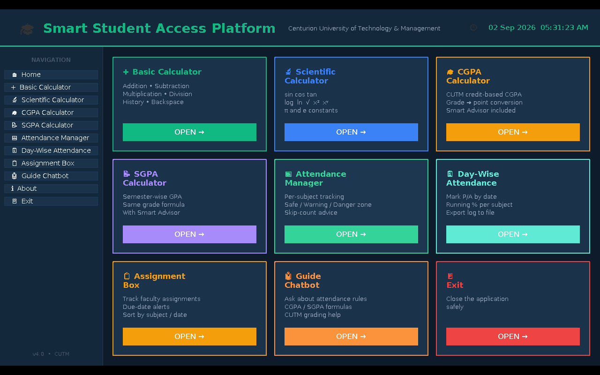
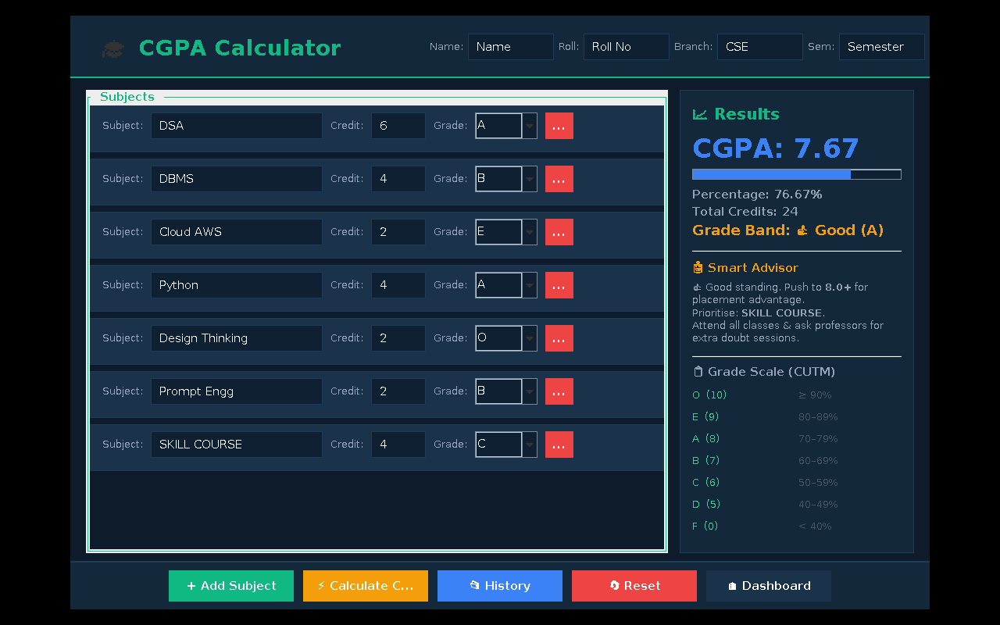
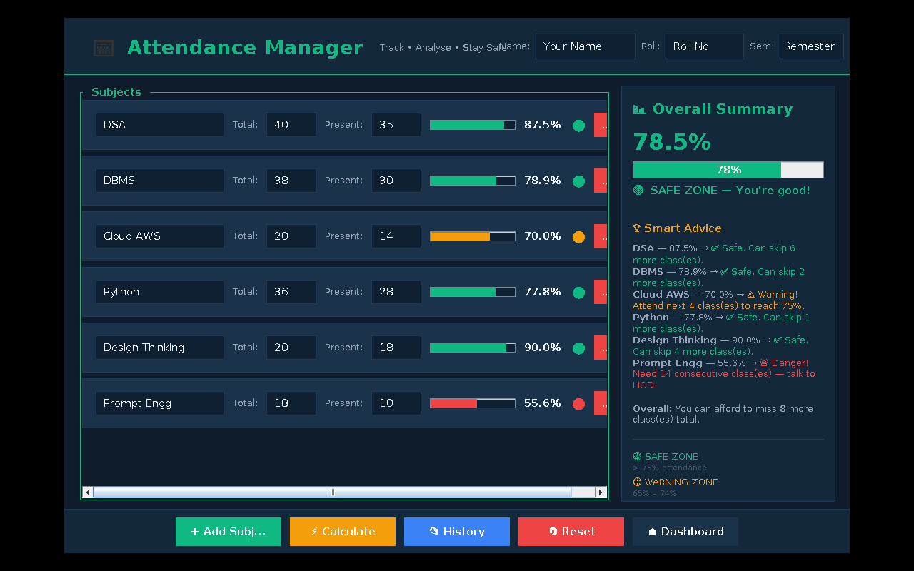
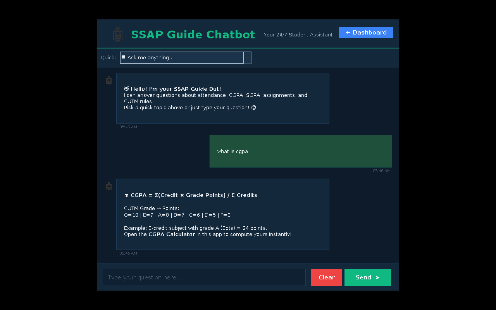

# 🎓 Smart Student Access Platform (v4.0)

A Java Swing desktop app for CUTM students — calculators, CGPA/SGPA tools, attendance tracking, an assignment tracker, and a rule-based guide chatbot, all in one dashboard.

**Team:** Satyam Pandey · Adarsh K. Tiwari · Manish Das · Simpon Sarangi
**Guide:** Centurion University of Technology & Management



---

## ⚠️ The bug that was breaking the build

The project **would not compile**, which is why "it wasn't working." The cause:

**`GuideChatbot.java` had `import java.util.*;` alongside `import javax.swing.*;`.**
Both packages contain a class named `Timer` (`java.util.Timer` and `javax.swing.Timer`). The chatbot's typing-delay code —

```java
Timer delay = new Timer(400, e -> { ... });
```

— needs `javax.swing.Timer` (the one that takes an `ActionListener` and has `setRepeats()`), but with both packages wildcard-imported, `javac` can't tell which `Timer` you mean and refuses to compile with:

```
error: reference to Timer is ambiguous
```

**Fix:** removed the unused `import java.util.*;` and replaced it with the one specific class the file actually needed — `import java.util.Date;`. No wildcard, no clash, no other code changed.

This was the *only* code change made. Everything else in your 12 files was already correct.

---

## ✅ What was verified

Every module was compiled and then actually run (not just read) to confirm it works end-to-end:

| Module | Status |
|---|---|
| Splash Screen → Dashboard | ✅ Loads and transitions correctly |
| Basic Calculator | ✅ Math + history tested |
| Scientific Calculator | ✅ Opens, all functions present |
| CGPA Calculator | ✅ Calculated CGPA 7.67 correctly from sample subjects, Smart Advisor works |
| SGPA Calculator | ✅ Opens and calculates |
| Attendance Manager | ✅ Percentages, Safe/Warning/Danger zones, Smart Advice all correct |
| Day-Wise Attendance | ✅ Marks P/A, saves a day's log, running % updates |
| Assignment Box | ✅ Added a test assignment, days-left calculated correctly |
| Guide Chatbot | ✅ Sent a message, got a correct rule-based reply (this is the exact code path that had the bug) |

A few screenshots from the test run:





More screenshots are in the `screenshots/` folder.

---

## 🗂 Project structure

```
SmartStudentAccessPlatform/
├── src/
│   ├── Main.java                 – entry point
│   ├── SplashScreen.java         – loading screen
│   ├── Dashboard.java            – main navigation hub
│   ├── Theme.java                – shared colors/fonts
│   ├── Calculator.java           – basic calculator
│   ├── ScientificCalculator.java
│   ├── CGPACalculator.java
│   ├── SGPACalculator.java
│   ├── AttendanceManager.java
│   ├── DayWiseAttendance.java
│   ├── AssignmentBox.java
│   └── GuideChatbot.java         – ⭐ contains the fix
├── screenshots/                  – proof-of-run screenshots
├── compile.bat / run.bat         – Windows
├── compile.sh  / run.sh          – Linux / macOS
└── README.md
```

## ▶️ How to run

**Requirements:** JDK 17 or newer installed (JRE alone won't work — you need `javac`). Check with:
```
java -version
javac -version
```

**Windows**
1. Double-click `compile.bat` (builds into an `out` folder).
2. Double-click `run.bat`.

**Linux / macOS**
```bash
chmod +x compile.sh run.sh
./compile.sh
./run.sh
```

**Manual (any OS)**
```bash
javac -encoding UTF-8 -d out src/*.java
java -cp out Main
```

> 💡 The `-encoding UTF-8` flag matters — several titles use emoji (📋, 📅, 🎓). Without it, some Windows setups compile fine but silently turn those into `?`.

## 🖥 Requirements
- JDK 17+ (built and tested on JDK 21)
- No external libraries — pure `javax.swing` / `java.awt`
- Windows, Linux, or macOS with a display (it's a desktop GUI app)
